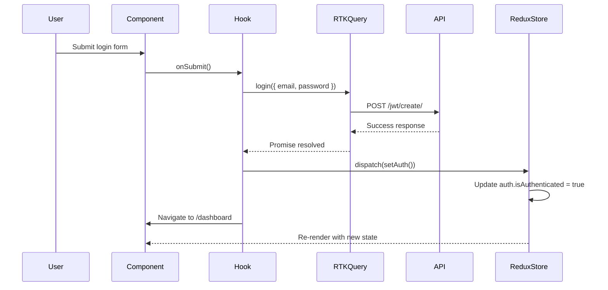
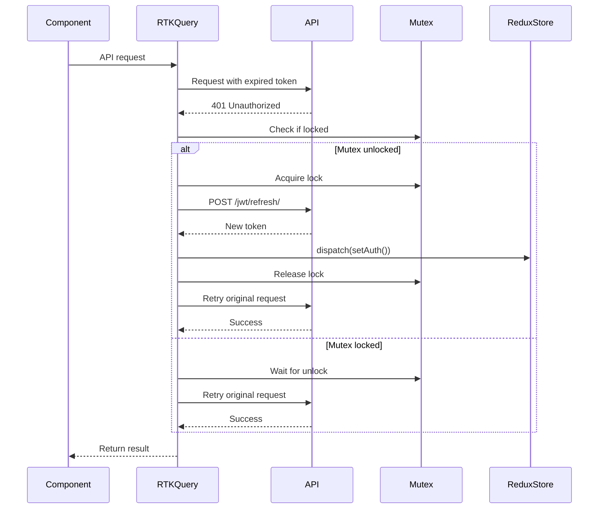
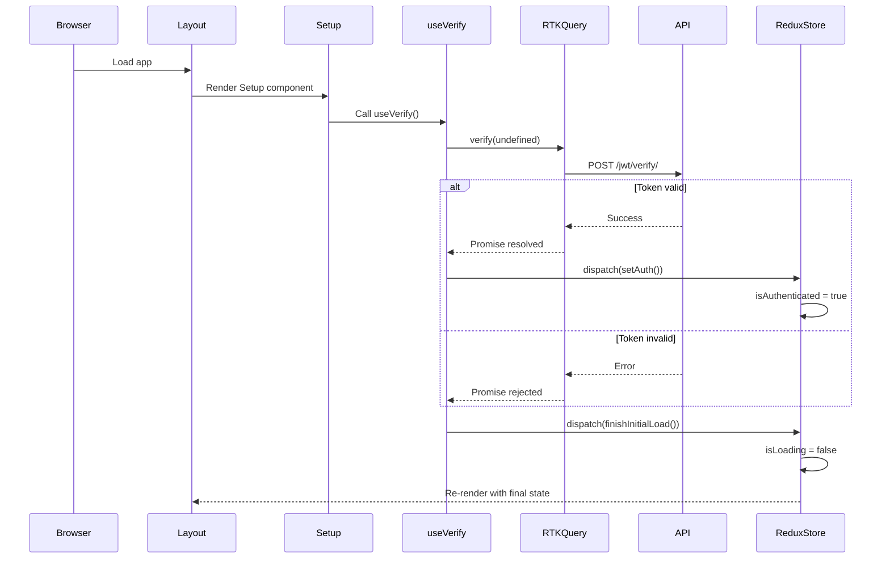
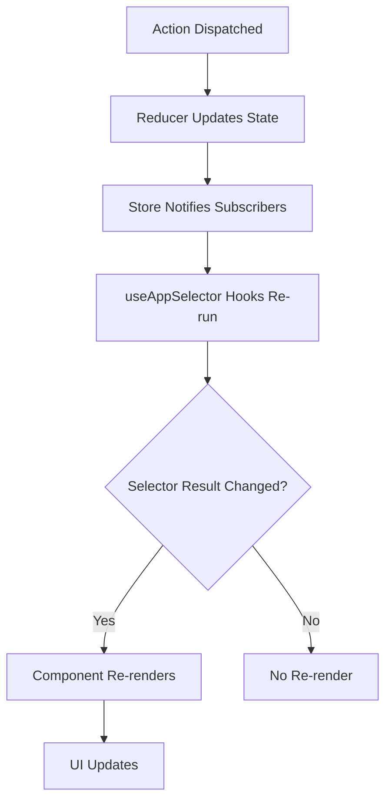

# State Management Documentation

**Last Updated:** 2024-12-19  
**Version:** 1.0.0  
**Stack:** Redux Toolkit 1.9.5 + RTK Query + React Redux 8.0.5

---

## Table of Contents

1. [Architecture Overview](#1-architecture-overview)
2. [Core Components](#2-core-components)
3. [Custom Hooks Pattern](#3-custom-hooks-pattern)
4. [Component Integration](#4-component-integration)
5. [Data Flow Diagrams](#5-data-flow-diagrams)
6. [Monitoring & Debugging](#6-monitoring--debugging)
7. [Scaling Guidelines](#7-scaling-guidelines)
8. [Best Practices & Conventions](#8-best-practices--conventions)
9. [Troubleshooting Guide](#9-troubleshooting-guide)
10. [Reference Quick Links](#10-reference-quick-links)

---

## 1. Architecture Overview

### Current Stack

The application uses **Redux Toolkit** (RTK) with **RTK Query** for state management and API data fetching. This provides:

- **Centralized State Management**: Single source of truth for application state
- **API Data Caching**: Automatic caching and synchronization via RTK Query
- **Type Safety**: Full TypeScript support with typed hooks and selectors
- **Developer Experience**: Redux DevTools integration for debugging

### State Structure

```
RootState
├── api (RTK Query cache)
│   ├── queries
│   ├── mutations
│   └── provided/invalidated tags
└── auth
    ├── isAuthenticated: boolean
    └── isLoading: boolean
```

### Store Configuration

The Redux store is configured in [`redux/store.ts`](redux/store.ts):

```5:13:redux/store.ts
export const store = configureStore({
	reducer: {
		[apiSlice.reducerPath]: apiSlice.reducer,
		auth: authReducer,
	},
	middleware: getDefaultMiddleware =>
		getDefaultMiddleware().concat(apiSlice.middleware),
	devTools: process.env.NODE_ENV !== 'production',
});
```

**Key Points:**
- Store combines RTK Query API slice with auth reducer
- RTK Query middleware handles caching and request deduplication
- DevTools enabled in development mode only
- TypeScript types exported: `RootState` and `AppDispatch`

### Provider Setup

The Redux Provider wraps the entire application in [`app/layout.tsx`](app/layout.tsx):

```23:30:app/layout.tsx
				<Provider>
					<Setup />
					<Navbar />
					<div className='mx-auto max-w-7xl px-2 sm:px-6 lg:px-8 my-8'>
						{children}
					</div>
					<Footer />
				</Provider>
```

The `Provider` component is a thin wrapper around React Redux's Provider:

```10:12:redux/provider.tsx
export default function CustomProvider({ children }: Props) {
	return <Provider store={store}>{children}</Provider>;
}
```

---

## 2. Core Components

### 2.1 Store Configuration (`redux/store.ts`)

**Purpose:** Central Redux store configuration combining all reducers and middleware.

**Key Exports:**
- `store`: Configured Redux store instance
- `RootState`: TypeScript type for the entire state tree
- `AppDispatch`: TypeScript type for dispatch function

**Configuration Details:**

| Aspect | Implementation |
|--------|---------------|
| **Reducers** | `apiSlice.reducer` (RTK Query), `authReducer` |
| **Middleware** | Default RTK middleware + RTK Query middleware |
| **DevTools** | Enabled in development (`NODE_ENV !== 'production'`) |
| **Type Safety** | Full TypeScript support with exported types |

**Usage:**
```typescript
import { store } from '@/redux/store';
import type { RootState, AppDispatch } from '@/redux/store';
```

### 2.2 API Slice (`redux/services/apiSlice.ts`)

**Purpose:** Base RTK Query API slice with automatic token refresh and error handling.

**Key Features:**

1. **Base Query Configuration**
   - Base URL: `${process.env.NEXT_PUBLIC_HOST}/api`
   - Credentials: `include` (for cookie-based auth)
   - Automatic error handling

2. **Token Refresh Mechanism**
   - Mutex-based lock prevents concurrent refresh requests
   - Automatic retry on 401 errors
   - Logout on refresh failure

```18:54:redux/services/apiSlice.ts
const baseQueryWithReauth: BaseQueryFn<
	string | FetchArgs,
	unknown,
	FetchBaseQueryError
> = async (args, api, extraOptions) => {
	await mutex.waitForUnlock();
	let result = await baseQuery(args, api, extraOptions);

	if (result.error && result.error.status === 401) {
		if (!mutex.isLocked()) {
			const release = await mutex.acquire();
			try {
				const refreshResult = await baseQuery(
					{
						url: '/jwt/refresh/',
						method: 'POST',
					},
					api,
					extraOptions
				);
				if (refreshResult.data) {
					api.dispatch(setAuth());

					result = await baseQuery(args, api, extraOptions);
				} else {
					api.dispatch(logout());
				}
			} finally {
				release();
			}
		} else {
			await mutex.waitForUnlock();
			result = await baseQuery(args, api, extraOptions);
		}
	}
	return result;
};
```

**Token Refresh Flow:**
1. Request fails with 401
2. Check if mutex is locked (refresh in progress)
3. If unlocked: acquire lock, refresh token, retry request
4. If locked: wait for unlock, retry request
5. On refresh failure: dispatch logout

**Current Debugging:**
- Console logs for base URL (lines 16-17) - should be removed in production

### 2.3 Auth Slice (`redux/features/authSlice.ts`)

**Purpose:** Manages authentication state (login status and loading state).

**State Shape:**
```typescript
interface AuthState {
	isAuthenticated: boolean;
	isLoading: boolean;
}
```

**Initial State:**
```8:11:redux/features/authSlice.ts
const initialState = {
	isAuthenticated: false,
	isLoading: true,
} as AuthState;
```

**Actions:**

| Action | Purpose | Effect |
|--------|---------|--------|
| `setAuth()` | Mark user as authenticated | Sets `isAuthenticated = true` |
| `logout()` | Mark user as logged out | Sets `isAuthenticated = false` |
| `finishInitialLoad()` | Complete initial auth check | Sets `isLoading = false` |

**Reducer Logic:**
```13:27:redux/features/authSlice.ts
const authSlice = createSlice({
	name: 'auth',
	initialState,
	reducers: {
		setAuth: state => {
			state.isAuthenticated = true;
		},
		logout: state => {
			state.isAuthenticated = false;
		},
		finishInitialLoad: state => {
			state.isLoading = false;
		},
	},
});
```

**Usage:**
```typescript
import { setAuth, logout, finishInitialLoad } from '@/redux/features/authSlice';
```

### 2.4 Auth API Slice (`redux/features/authApiSlice.ts`)

**Purpose:** RTK Query endpoints for all authentication-related API calls.

**Endpoints:**

| Endpoint | Type | Hook | Purpose |
|----------|------|------|---------|
| `retrieveUser` | Query | `useRetrieveUserQuery` | Get current user data |
| `socialAuthenticate` | Mutation | `useSocialAuthenticateMutation` | OAuth login (Google/Facebook) |
| `login` | Mutation | `useLoginMutation` | Email/password login |
| `register` | Mutation | `useRegisterMutation` | User registration |
| `verify` | Mutation | `useVerifyMutation` | Verify JWT token |
| `logout` | Mutation | `useLogoutMutation` | Logout user |
| `activation` | Mutation | `useActivationMutation` | Activate account via email |
| `resetPassword` | Mutation | `useResetPasswordMutation` | Request password reset |
| `resetPasswordConfirm` | Mutation | `useResetPasswordConfirmMutation` | Confirm password reset |

**Query vs Mutation:**
- **Queries**: Read operations, cached automatically (e.g., `retrieveUser`)
- **Mutations**: Write operations, not cached (e.g., `login`, `register`)

**TypeScript Interfaces:**

```3:18:redux/features/authApiSlice.ts
interface User {
	first_name: string;
	last_name: string;
	email: string;
}

interface SocialAuthArgs {
	provider: string;
	state: string;
	code: string;
}

interface CreateUserResponse {
	success: boolean;
	user: User;
}
```

**Generated Hooks:**
All hooks follow RTK Query naming convention:
- Queries: `use[EndpointName]Query`
- Mutations: `use[EndpointName]Mutation`

**Example Usage:**
```typescript
const { data: user, isLoading } = useRetrieveUserQuery();
const [login, { isLoading }] = useLoginMutation();
```

### 2.5 Typed Hooks (`redux/hooks.ts`)

**Purpose:** Type-safe wrappers around React Redux hooks.

```5:6:redux/hooks.ts
export const useAppDispatch: () => AppDispatch = useDispatch;
export const useAppSelector: TypedUseSelectorHook<RootState> = useSelector;
```

**Why Use These:**
- Type safety: `useAppDispatch` returns typed `AppDispatch`
- Type safety: `useAppSelector` knows the `RootState` shape
- Prevents common TypeScript errors
- Consistent usage across codebase

**Usage:**
```typescript
import { useAppDispatch, useAppSelector } from '@/redux/hooks';

const dispatch = useAppDispatch();
const isAuthenticated = useAppSelector(state => state.auth.isAuthenticated);
```

---

## 3. Custom Hooks Pattern

**Location:** `hooks/` directory

**Pattern:** Custom hooks combine RTK Query hooks with local component state and business logic.

### Hook Structure

All custom hooks follow this pattern:
1. Use RTK Query hooks for API calls
2. Manage local form state with `useState`
3. Handle form events (onChange, onSubmit)
4. Dispatch Redux actions on success/error
5. Return form data and handlers

### Available Hooks

#### `use-login.ts`
**Purpose:** Handle login form state and submission.

```8:48:hooks/use-login.ts
export default function useLogin() {
	const router = useRouter();
	const dispatch = useAppDispatch();
	const [login, { isLoading }] = useLoginMutation();

	const [formData, setFormData] = useState({
		email: '',
		password: '',
	});

	const { email, password } = formData;

	const onChange = (event: ChangeEvent<HTMLInputElement>) => {
		const { name, value } = event.target;

		setFormData({ ...formData, [name]: value });
	};

	const onSubmit = (event: FormEvent<HTMLFormElement>) => {
		event.preventDefault();

		login({ email, password })
			.unwrap()
			.then(() => {
				dispatch(setAuth());
				toast.success('Logged in');
				router.push('/dashboard');
			})
			.catch(() => {
				toast.error('Failed to log in');
			});
	};

	return {
		email,
		password,
		isLoading,
		onChange,
		onSubmit,
	};
}
```

**Key Points:**
- Uses `useLoginMutation` from RTK Query
- Dispatches `setAuth()` on success
- Handles navigation and toast notifications
- Returns form state and handlers

#### `use-register.ts`
**Purpose:** Handle registration form state and submission.

**Similar pattern to `use-login.ts`** but:
- Uses `useRegisterMutation`
- Does NOT dispatch `setAuth()` (user must verify email first)
- Navigates to login page on success

#### `use-verify.ts`
**Purpose:** Verify JWT token on app initialization.

```6:21:hooks/use-verify.ts
export default function useVerify() {
	const dispatch = useAppDispatch();

	const [verify] = useVerifyMutation();

	useEffect(() => {
		verify(undefined)
			.unwrap()
			.then(() => {
				dispatch(setAuth());
			})
			.finally(() => {
				dispatch(finishInitialLoad());
			});
	}, []);
}
```

**Key Points:**
- Runs once on mount (`useEffect` with empty deps)
- Dispatches `setAuth()` if token is valid
- Always dispatches `finishInitialLoad()` to stop loading state
- Used in `Setup` component (app initialization)

#### `use-social-auth.ts`
**Purpose:** Handle OAuth callback (Google/Facebook).

```7:36:hooks/use-social-auth.ts
export default function useSocialAuth(authenticate: any, provider: string) {
	const dispatch = useAppDispatch();
	const router = useRouter();
	const searchParams = useSearchParams();

	const effectRan = useRef(false);

	useEffect(() => {
		const state = searchParams.get('state');
		const code = searchParams.get('code');

		if (state && code && !effectRan.current) {
			authenticate({ provider, state, code })
				.unwrap()
				.then(() => {
					dispatch(setAuth());
					toast.success('Logged in');
					router.push('/dashboard');
				})
				.catch(() => {
					toast.error('Failed to log in');
					router.push('/auth/login');
				});
		}

		return () => {
			effectRan.current = true;
		};
	}, [authenticate, provider]);
}
```

**Key Points:**
- Uses `useRef` to prevent double execution
- Extracts OAuth params from URL
- Dispatches `setAuth()` on success
- Handles navigation and errors

#### `use-reset-password.ts` & `use-reset-password-confirm.ts`
**Purpose:** Handle password reset flow.

**Pattern:** Similar to login/register hooks but without auth state changes.

### Hook Composition Guidelines

1. **Keep hooks focused:** One hook per feature/flow
2. **Separate concerns:** Form state vs API calls vs navigation
3. **Return consistent shape:** Always return form data + handlers + loading state
4. **Handle errors:** Use toast notifications or error state
5. **Type safety:** Use TypeScript interfaces for form data

---

## 4. Component Integration

### Usage Patterns

#### Reading State: `useAppSelector`

```17:17:components/common/Navbar.tsx
	const { isAuthenticated } = useAppSelector(state => state.auth);
```

**Best Practices:**
- Select only needed state (prevents unnecessary re-renders)
- Use selector functions for derived state
- Access nested state: `state.auth.isAuthenticated`

#### Dispatching Actions: `useAppDispatch`

```13:13:components/common/Navbar.tsx
	const dispatch = useAppDispatch();
```

```19:24:components/common/Navbar.tsx
	const handleLogout = () => {
		logout(undefined)
			.unwrap()
			.then(() => {
				dispatch(setLogout());
			});
	};
```

**Best Practices:**
- Dispatch actions after async operations complete
- Use RTK Query mutations, then dispatch sync actions if needed
- Handle errors before dispatching

#### Using RTK Query Hooks

**Query Example:**
```7:7:app/dashboard/page.tsx
	const { data: user, isLoading, isFetching } = useRetrieveUserQuery();
```

**Mutation Example:**
```11:11:hooks/use-login.ts
	const [login, { isLoading }] = useLoginMutation();
```

**Mutation Usage:**
```29:38:hooks/use-login.ts
		login({ email, password })
			.unwrap()
			.then(() => {
				dispatch(setAuth());
				toast.success('Logged in');
				router.push('/dashboard');
			})
			.catch(() => {
				toast.error('Failed to log in');
			});
```

### Component Examples

#### Protected Routes: `RequireAuth.tsx`

```11:27:components/utils/RequireAuth.tsx
export default function RequireAuth({ children }: Props) {
	const { isLoading, isAuthenticated } = useAppSelector(state => state.auth);

	if (isLoading) {
		return (
			<div className='flex justify-center my-8'>
				<Spinner lg />
			</div>
		);
	}

	if (!isAuthenticated) {
		redirect('/auth/login');
	}

	return <>{children}</>;
}
```

**Pattern:**
- Check `isLoading` first (show spinner)
- Check `isAuthenticated` (redirect if false)
- Render children if authenticated

#### App Initialization: `Setup.tsx`

```6:9:components/utils/Setup.tsx
export default function Setup() {
	useVerify();
	return <Toaster richColors position="top-right" />;
}
```

**Purpose:**
- Runs `useVerify()` on app load
- Sets up toast notifications
- Rendered once in root layout

#### Navigation: `Navbar.tsx`

**Pattern:**
- Reads auth state to show/hide links
- Dispatches logout action
- Uses RTK Query mutation for logout API call

```15:25:components/common/Navbar.tsx
	const [logout] = useLogoutMutation();

	const { isAuthenticated } = useAppSelector(state => state.auth);

	const handleLogout = () => {
		logout(undefined)
			.unwrap()
			.then(() => {
				dispatch(setLogout());
			});
	};
```

### Best Practices for Component-State Interaction

1. **Use typed hooks:** Always use `useAppDispatch` and `useAppSelector`
2. **Select minimal state:** Only select what you need
3. **Memoize selectors:** For expensive computations, use `useMemo`
4. **Handle loading states:** Always check `isLoading` before rendering data
5. **Separate concerns:** Keep API calls in hooks, not components
6. **Error handling:** Use RTK Query error states or toast notifications

---

## 5. Data Flow Diagrams

### Authentication Flow



### Token Refresh Flow



### Initial App Load Flow



### State Update Propagation



---

## 6. Monitoring & Debugging

### 6.1 Redux DevTools

**Access:** Install [Redux DevTools Extension](https://github.com/reduxjs/redux-devtools) for Chrome/Firefox.

**Key Features:**

1. **Time-Travel Debugging**
   - Step through actions one by one
   - Jump to any previous state
   - See state changes in real-time

2. **Action Inspection**
   - View all dispatched actions
   - See action payloads
   - Filter actions by type

3. **State Inspection**
   - View current state tree
   - Search state values
   - Export/import state snapshots

4. **Performance Monitoring**
   - See action dispatch times
   - Identify slow reducers
   - Track re-render frequency

**Usage:**
1. Open browser DevTools (F12)
2. Go to "Redux" tab
3. Interact with your app
4. See actions and state changes

**Example Actions to Monitor:**
- `auth/setAuth` - User logged in
- `auth/logout` - User logged out
- `auth/finishInitialLoad` - Initial load complete
- `api/executeQuery` - RTK Query requests
- `api/executeMutation` - RTK Query mutations

### 6.2 RTK Query DevTools

RTK Query integrates with Redux DevTools. Look for:

1. **Cache Inspection**
   - View cached queries
   - See cache timestamps
   - Check cache invalidation

2. **Request/Response Logging**
   - See all API requests
   - View request/response data
   - Monitor request status

3. **Tag Tracking**
   - See provided/invalidated tags
   - Understand cache invalidation flow

**Cache Structure in DevTools:**
```
api
├── queries
│   └── retrieveUser(undefined)
│       ├── status: "fulfilled"
│       ├── data: { first_name, last_name, email }
│       └── fulfilledTimeStamp: 1234567890
└── mutations
    └── login({ email, password })
        ├── status: "pending"
        └── requestId: "abc123"
```

### 6.3 Common Debugging Scenarios

#### Authentication State Not Updating

**Symptoms:**
- User logs in but UI doesn't update
- `isAuthenticated` stays `false`
- Navigation doesn't work

**Debugging Steps:**
1. Check Redux DevTools: Is `setAuth` action dispatched?
2. Check action payload: Is reducer receiving the action?
3. Check selector: Is component selecting correct state?
4. Check component: Is component subscribed to store?

**Common Causes:**
- Forgot to dispatch `setAuth()` after login
- Component not using `useAppSelector`
- Selector selecting wrong state path

**Solution:**
```typescript
// After successful login
login({ email, password })
  .unwrap()
  .then(() => {
    dispatch(setAuth()); // ← Make sure this is called
  });
```

#### Token Refresh Failures

**Symptoms:**
- User gets logged out unexpectedly
- 401 errors persist after refresh
- Multiple refresh requests

**Debugging Steps:**
1. Check network tab: Is `/jwt/refresh/` called?
2. Check response: Does refresh return new token?
3. Check mutex: Are multiple refreshes happening?
4. Check console: Any error logs?

**Common Causes:**
- Refresh endpoint returning error
- Mutex not working correctly
- Cookie not being sent

**Solution:**
- Check `apiSlice.ts` mutex logic (lines 23-52)
- Verify `credentials: 'include'` in base query
- Check backend refresh endpoint

#### API Request Failures

**Symptoms:**
- Requests fail silently
- No error messages
- Loading states stuck

**Debugging Steps:**
1. Check network tab: See actual HTTP response
2. Check RTK Query cache: See error in DevTools
3. Check component: Is error state handled?
4. Check console: Any error logs?

**Common Causes:**
- Network error
- Server error (500, 503)
- CORS issues
- Missing credentials

**Solution:**
```typescript
const { data, error, isLoading } = useRetrieveUserQuery();

if (error) {
  console.error('API Error:', error);
  // Handle error in UI
}
```

#### State Synchronization Issues

**Symptoms:**
- State out of sync between components
- Old data showing
- Cache not updating

**Debugging Steps:**
1. Check RTK Query cache: Is data cached?
2. Check cache tags: Are tags invalidated?
3. Check refetch: Is query refetching?
4. Check timestamps: Is cache stale?

**Common Causes:**
- Cache not invalidated after mutation
- Stale cache data
- Query not refetching

**Solution:**
- Use cache tags for invalidation
- Manually refetch queries
- Clear cache if needed

#### Component Re-render Debugging

**Symptoms:**
- Too many re-renders
- Performance issues
- Unnecessary updates

**Debugging Steps:**
1. Use React DevTools Profiler
2. Check selector: Is it selecting too much?
3. Check dependencies: Are hooks deps correct?
4. Check Redux: Are actions dispatched unnecessarily?

**Common Causes:**
- Selecting entire state object
- Creating new objects in selector
- Missing memoization

**Solution:**
```typescript
// Bad: Selects entire auth state
const auth = useAppSelector(state => state.auth);

// Good: Selects only needed value
const isAuthenticated = useAppSelector(state => state.auth.isAuthenticated);
```

### 6.4 Logging Strategy

#### Current Logging

**Location:** `redux/services/apiSlice.ts` (lines 16-17)

```16:17:redux/services/apiSlice.ts
console.log('API Base URL:', `${process.env.NEXT_PUBLIC_HOST}/api`);
console.log('NEXT_PUBLIC_HOST value:', process.env.NEXT_PUBLIC_HOST);
```

**Issue:** These console logs should be removed in production.

#### Recommended Logging Patterns

**Development:**
```typescript
if (process.env.NODE_ENV === 'development') {
  console.log('Action dispatched:', action);
  console.log('State updated:', state);
}
```

**Production:**
- Use error tracking service (Sentry, LogRocket)
- Log only errors, not debug info
- Remove all `console.log` statements

**RTK Query Logging:**
RTK Query automatically logs to Redux DevTools. For additional logging:

```typescript
const baseQueryWithLogging = async (args, api, extraOptions) => {
  const result = await baseQuery(args, api, extraOptions);
  
  if (process.env.NODE_ENV === 'development') {
    console.log('API Request:', args);
    console.log('API Response:', result);
  }
  
  return result;
};
```

**Best Practices:**
1. Remove debug logs before production
2. Use structured logging format
3. Log errors with context
4. Don't log sensitive data (tokens, passwords)
5. Use error tracking service in production

---

## 7. Scaling Guidelines

### 7.1 Adding New Features

#### Creating New Slices

**Step 1:** Create slice file in `redux/features/`

```typescript
// redux/features/userSlice.ts
import { createSlice } from '@reduxjs/toolkit';

interface UserState {
  profile: User | null;
  preferences: UserPreferences;
}

const initialState: UserState = {
  profile: null,
  preferences: {},
};

const userSlice = createSlice({
  name: 'user',
  initialState,
  reducers: {
    setProfile: (state, action) => {
      state.profile = action.payload;
    },
  },
});

export const { setProfile } = userSlice.actions;
export default userSlice.reducer;
```

**Step 2:** Add reducer to store

```typescript
// redux/store.ts
import userReducer from './features/userSlice';

export const store = configureStore({
  reducer: {
    [apiSlice.reducerPath]: apiSlice.reducer,
    auth: authReducer,
    user: userReducer, // ← Add here
  },
  // ...
});
```

**Step 3:** Export types (if needed)

```typescript
// Update RootState type automatically includes new slice
export type RootState = ReturnType<typeof store.getState>;
```

#### Adding New API Endpoints

**Step 1:** Inject endpoint into API slice

```typescript
// redux/features/userApiSlice.ts
import { apiSlice } from '../services/apiSlice';

export const userApiSlice = apiSlice.injectEndpoints({
  endpoints: builder => ({
    getUserProfile: builder.query<User, void>({
      query: () => '/users/profile/',
    }),
    updateProfile: builder.mutation<User, Partial<User>>({
      query: (data) => ({
        url: '/users/profile/',
        method: 'PUT',
        body: data,
      }),
    }),
  }),
});

export const {
  useGetUserProfileQuery,
  useUpdateProfileMutation,
} = userApiSlice;
```

**Step 2:** Use generated hooks in components

```typescript
const { data: profile } = useGetUserProfileQuery();
const [updateProfile] = useUpdateProfileMutation();
```

#### Extending State Shape

**Guidelines:**
1. Keep state normalized (avoid nested objects)
2. Use TypeScript interfaces for type safety
3. Update initial state when adding fields
4. Update reducers to handle new fields

**Example:**
```typescript
// Before
interface AuthState {
  isAuthenticated: boolean;
  isLoading: boolean;
}

// After (extended)
interface AuthState {
  isAuthenticated: boolean;
  isLoading: boolean;
  user: User | null; // ← New field
  lastLogin: string | null; // ← New field
}
```

#### Maintaining Type Safety

**Best Practices:**
1. Always use TypeScript interfaces
2. Export types from slice files
3. Use `RootState` type for selectors
4. Use `AppDispatch` type for dispatch
5. Type action payloads

**Example:**
```typescript
// Typed action
interface SetUserPayload {
  user: User;
  timestamp: number;
}

const userSlice = createSlice({
  // ...
  reducers: {
    setUser: (state, action: PayloadAction<SetUserPayload>) => {
      state.user = action.payload.user;
      state.lastLogin = new Date(action.payload.timestamp).toISOString();
    },
  },
});
```

### 7.2 Performance Optimization

#### RTK Query Caching Strategies

**Default Behavior:**
- Queries cached for 60 seconds
- Mutations not cached
- Cache shared across components

**Custom Cache Configuration:**

```typescript
retrieveUser: builder.query<User, void>({
  query: () => '/users/me/',
  // Cache for 5 minutes
  keepUnusedDataFor: 300,
  // Refetch on mount
  refetchOnMountOrArgChange: true,
}),
```

**Cache Tags (for invalidation):**

```typescript
getUserProfile: builder.query<User, void>({
  query: () => '/users/profile/',
  providesTags: ['UserProfile'],
}),

updateProfile: builder.mutation<User, Partial<User>>({
  query: (data) => ({
    url: '/users/profile/',
    method: 'PUT',
    body: data,
  }),
  invalidatesTags: ['UserProfile'], // ← Invalidates cache
}),
```

#### Selector Optimization

**Problem:** Selecting entire state causes re-renders

```typescript
// Bad: Re-renders on any state change
const state = useAppSelector(state => state);

// Good: Only re-renders when auth changes
const auth = useAppSelector(state => state.auth);
```

**Memoized Selectors:**

```typescript
import { createSelector } from '@reduxjs/toolkit';

const selectAuth = (state: RootState) => state.auth;
const selectIsAuthenticated = createSelector(
  [selectAuth],
  (auth) => auth.isAuthenticated
);

// Usage
const isAuthenticated = useAppSelector(selectIsAuthenticated);
```

#### Preventing Unnecessary Re-renders

**Guidelines:**
1. Select only needed state
2. Use memoized selectors for derived state
3. Memoize callbacks with `useCallback`
4. Memoize components with `React.memo`

**Example:**
```typescript
const MemoizedComponent = React.memo(({ user }) => {
  // Component logic
});

// In parent
const user = useAppSelector(state => state.user.profile);
return <MemoizedComponent user={user} />;
```

#### Code Splitting Considerations

**Lazy Load Slices:**
```typescript
// Not recommended: All slices loaded upfront
import userReducer from './features/userSlice';

// Consider: Code split rarely used slices
// Use dynamic imports for large features
```

**RTK Query Code Splitting:**
RTK Query automatically code-splits endpoints. No additional configuration needed.

### 7.3 State Normalization

#### When to Normalize Data

**Normalize when:**
- Same data appears in multiple places
- Data has relationships (users, posts, comments)
- Need to update data in one place

**Don't normalize when:**
- Data is simple and flat
- Data is only used once
- Normalization adds complexity

#### Entity Adapters (Future Consideration)

RTK provides `createEntityAdapter` for normalized state:

```typescript
import { createEntityAdapter } from '@reduxjs/toolkit';

const usersAdapter = createEntityAdapter<User>();

const userSlice = createSlice({
  name: 'users',
  initialState: usersAdapter.getInitialState(),
  reducers: {
    addUser: usersAdapter.addOne,
    updateUser: usersAdapter.updateOne,
    removeUser: usersAdapter.removeOne,
  },
});

// Selectors
const { selectAll, selectById } = usersAdapter.getSelectors(
  (state: RootState) => state.users
);
```

**Benefits:**
- Automatic normalization
- Optimized selectors
- CRUD operations built-in

#### Avoiding Duplicate State

**Anti-pattern:**
```typescript
// Bad: Duplicate state
const authState = { isAuthenticated: true };
const userState = { isAuthenticated: true }; // ← Duplicate
```

**Good pattern:**
```typescript
// Good: Single source of truth
const authState = { isAuthenticated: true };
// Reference auth state, don't duplicate
```

### 7.4 Middleware Considerations

#### When to Add Custom Middleware

**Add middleware for:**
- Logging actions
- Persisting state to localStorage
- Handling async side effects
- Error handling

**Example: Logging Middleware:**

```typescript
const loggerMiddleware: Middleware = (store) => (next) => (action) => {
  if (process.env.NODE_ENV === 'development') {
    console.log('Dispatching:', action);
    const result = next(action);
    console.log('Next state:', store.getState());
    return result;
  }
  return next(action);
};

export const store = configureStore({
  reducer: { /* ... */ },
  middleware: (getDefaultMiddleware) =>
    getDefaultMiddleware().concat(loggerMiddleware),
});
```

#### Async Action Patterns

**RTK Query handles async automatically.** For custom async actions:

```typescript
// Use createAsyncThunk
import { createAsyncThunk } from '@reduxjs/toolkit';

const fetchUserData = createAsyncThunk(
  'user/fetchData',
  async (userId: string) => {
    const response = await fetch(`/api/users/${userId}`);
    return response.json();
  }
);

// In component
dispatch(fetchUserData('123'));
```

#### Side Effect Management

**Guidelines:**
1. Use RTK Query for API calls
2. Use `createAsyncThunk` for complex async logic
3. Use middleware for cross-cutting concerns
4. Keep reducers pure (no side effects)

---

## 8. Best Practices & Conventions

### 8.1 Naming Conventions

#### Slices
- **File:** `[feature]Slice.ts` (e.g., `authSlice.ts`)
- **Slice name:** `[feature]` (e.g., `auth`)
- **Actions:** `camelCase` (e.g., `setAuth`, `finishInitialLoad`)

#### API Slices
- **File:** `[feature]ApiSlice.ts` (e.g., `authApiSlice.ts`)
- **Endpoints:** `camelCase` (e.g., `retrieveUser`, `resetPassword`)
- **Hooks:** Auto-generated `use[Endpoint]Query` or `use[Endpoint]Mutation`

#### Custom Hooks
- **File:** `use-[feature].ts` (e.g., `use-login.ts`)
- **Function:** `use[Feature]` (e.g., `useLogin`)

#### Components
- **File:** `PascalCase.tsx` (e.g., `Navbar.tsx`)
- **Component:** `PascalCase` (e.g., `Navbar`)

### 8.2 File Organization Structure

```
redux/
├── store.ts              # Store configuration
├── hooks.ts              # Typed hooks
├── provider.tsx          # Redux Provider wrapper
├── features/             # Feature slices
│   ├── authSlice.ts
│   └── authApiSlice.ts
└── services/             # Shared services
    └── apiSlice.ts       # Base API slice

hooks/
├── index.ts              # Hook exports
├── use-login.ts
├── use-register.ts
└── use-verify.ts
```

### 8.3 TypeScript Patterns

#### Type Exports
```typescript
// Export types from slice
export type { AuthState } from './features/authSlice';

// Export RootState from store
export type { RootState, AppDispatch } from './store';
```

#### Typed Hooks
```typescript
// Always use typed hooks
import { useAppDispatch, useAppSelector } from '@/redux/hooks';
```

#### Interface Definitions
```typescript
// Define interfaces near usage
interface User {
  id: string;
  email: string;
}

// Or in separate types file for shared types
// types/user.ts
```

### 8.4 Error Handling Patterns

#### RTK Query Errors
```typescript
const { data, error, isLoading } = useRetrieveUserQuery();

if (error) {
  // Handle error
  if ('status' in error) {
    // FetchBaseQueryError
    console.error('Status:', error.status);
  } else {
    // SerializedError
    console.error('Error:', error.message);
  }
}
```

#### Mutation Errors
```typescript
const [login, { error }] = useLoginMutation();

login({ email, password })
  .unwrap()
  .then(() => {
    // Success
  })
  .catch((error) => {
    // Handle error
    toast.error(error.data?.message || 'Login failed');
  });
```

#### Global Error Handling
Consider adding error handling middleware:

```typescript
const errorMiddleware: Middleware = () => (next) => (action) => {
  if (action.type.endsWith('/rejected')) {
    // Handle rejected actions
    console.error('Action rejected:', action);
  }
  return next(action);
};
```

### 8.5 Testing Considerations

#### Testing Slices
```typescript
import { configureStore } from '@reduxjs/toolkit';
import authReducer, { setAuth, logout } from './authSlice';

describe('authSlice', () => {
  it('should set authenticated state', () => {
    const store = configureStore({ reducer: { auth: authReducer } });
    store.dispatch(setAuth());
    expect(store.getState().auth.isAuthenticated).toBe(true);
  });
});
```

#### Testing RTK Query
```typescript
import { renderHook, waitFor } from '@testing-library/react';
import { useRetrieveUserQuery } from './authApiSlice';

// Mock API responses
// Use MSW (Mock Service Worker) or similar
```

#### Testing Components
```typescript
import { Provider } from 'react-redux';
import { store } from '@/redux/store';

const renderWithRedux = (component: React.ReactElement) => {
  return render(
    <Provider store={store}>
      {component}
    </Provider>
  );
};
```

---

## 9. Troubleshooting Guide

### Common Errors and Solutions

#### Error: "Cannot read property 'auth' of undefined"

**Cause:** Component not wrapped in Redux Provider

**Solution:**
```typescript
// Make sure Provider wraps app
// app/layout.tsx
<Provider store={store}>
  {children}
</Provider>
```

#### Error: "Actions must be plain objects"

**Cause:** Dispatching async action without middleware

**Solution:**
- Use RTK Query hooks (handles async automatically)
- Or use `createAsyncThunk` for custom async actions

#### Error: "useSelector must be used within a Provider"

**Cause:** Using `useSelector` outside Provider

**Solution:**
- Check component tree
- Ensure Provider wraps component
- Use `useAppSelector` (typed version)

#### Error: Token refresh loop

**Cause:** Refresh endpoint returning 401

**Solution:**
- Check refresh endpoint implementation
- Verify cookie is being sent
- Check mutex logic in `apiSlice.ts`

#### Error: State not updating

**Cause:** Not dispatching action or reducer not handling action

**Solution:**
1. Check Redux DevTools: Is action dispatched?
2. Check reducer: Does it handle the action?
3. Check selector: Is component selecting correct state?

### State Management Anti-patterns to Avoid

#### 1. Mutating State Directly

```typescript
// Bad: Mutating state
state.auth.isAuthenticated = true;

// Good: Using Immer (RTK does this automatically)
dispatch(setAuth());
```

#### 2. Storing Derived State

```typescript
// Bad: Storing computed values
state.fullName = `${state.firstName} ${state.lastName}`;

// Good: Compute in selector
const fullName = useAppSelector(state => 
  `${state.user.firstName} ${state.user.lastName}`
);
```

#### 3. Duplicating API Data in State

```typescript
// Bad: Storing API data separately
state.user = apiResponse.user;
state.userProfile = apiResponse.user; // ← Duplicate

// Good: Use RTK Query cache
const { data: user } = useRetrieveUserQuery();
```

#### 4. Dispatching in Reducers

```typescript
// Bad: Side effects in reducer
reducers: {
  setAuth: (state, action) => {
    state.isAuthenticated = true;
    dispatch(anotherAction()); // ← Don't do this
  },
}

// Good: Dispatch in component/hook
dispatch(setAuth());
dispatch(anotherAction());
```

#### 5. Selecting Entire State

```typescript
// Bad: Causes unnecessary re-renders
const state = useAppSelector(state => state);

// Good: Select only needed
const isAuthenticated = useAppSelector(state => state.auth.isAuthenticated);
```

### Migration Patterns for Future Changes

#### Migrating to New State Shape

**Step 1:** Add new fields alongside old ones
```typescript
interface AuthState {
  isAuthenticated: boolean;
  isLoading: boolean;
  // New fields
  user: User | null;
}
```

**Step 2:** Update reducers to handle both
```typescript
reducers: {
  setAuth: (state, action) => {
    state.isAuthenticated = true;
    state.user = action.payload?.user || null;
  },
}
```

**Step 3:** Update components gradually
**Step 4:** Remove old fields after migration

#### Migrating to Entity Adapters

**Step 1:** Install/create adapter
**Step 2:** Migrate state shape
**Step 3:** Update selectors
**Step 4:** Update components

#### Upgrading RTK Query

**Step 1:** Update package version
**Step 2:** Check breaking changes
**Step 3:** Update API slice syntax if needed
**Step 4:** Test all endpoints

---

## 10. Reference Quick Links

### File Paths

| File | Purpose |
|------|---------|
| [`redux/store.ts`](redux/store.ts) | Store configuration |
| [`redux/services/apiSlice.ts`](redux/services/apiSlice.ts) | Base API slice with token refresh |
| [`redux/features/authSlice.ts`](redux/features/authSlice.ts) | Auth state management |
| [`redux/features/authApiSlice.ts`](redux/features/authApiSlice.ts) | Auth API endpoints |
| [`redux/hooks.ts`](redux/hooks.ts) | Typed Redux hooks |
| [`redux/provider.tsx`](redux/provider.tsx) | Redux Provider wrapper |
| [`hooks/use-login.ts`](hooks/use-login.ts) | Login hook |
| [`hooks/use-register.ts`](hooks/use-register.ts) | Register hook |
| [`hooks/use-verify.ts`](hooks/use-verify.ts) | Token verification hook |
| [`components/utils/RequireAuth.tsx`](components/utils/RequireAuth.tsx) | Protected route component |
| [`components/utils/Setup.tsx`](components/utils/Setup.tsx) | App initialization |
| [`components/common/Navbar.tsx`](components/common/Navbar.tsx) | Navigation with auth state |
| [`app/layout.tsx`](app/layout.tsx) | Root layout with Provider |
| [`app/dashboard/page.tsx`](app/dashboard/page.tsx) | Dashboard using RTK Query |

### Key Exports

#### From `redux/store.ts`
- `store` - Redux store instance
- `RootState` - TypeScript type for state tree
- `AppDispatch` - TypeScript type for dispatch

#### From `redux/hooks.ts`
- `useAppDispatch` - Typed dispatch hook
- `useAppSelector` - Typed selector hook

#### From `redux/features/authSlice.ts`
- `setAuth` - Action to set authenticated state
- `logout` - Action to logout user
- `finishInitialLoad` - Action to finish initial load

#### From `redux/features/authApiSlice.ts`
- `useRetrieveUserQuery` - Get current user
- `useLoginMutation` - Login mutation
- `useRegisterMutation` - Register mutation
- `useVerifyMutation` - Verify token mutation
- `useLogoutMutation` - Logout mutation
- `useSocialAuthenticateMutation` - OAuth login
- `useActivationMutation` - Activate account
- `useResetPasswordMutation` - Request password reset
- `useResetPasswordConfirmMutation` - Confirm password reset

### Dependency Versions

| Package | Version |
|---------|---------|
| `@reduxjs/toolkit` | ^1.9.5 |
| `react-redux` | ^8.0.5 |
| `async-mutex` | ^0.4.0 |

### External Resources

- [Redux Toolkit Documentation](https://redux-toolkit.js.org/)
- [RTK Query Documentation](https://redux-toolkit.js.org/rtk-query/overview)
- [React Redux Documentation](https://react-redux.js.org/)
- [Redux DevTools Extension](https://github.com/reduxjs/redux-devtools-extension)
- [TypeScript with Redux](https://redux-toolkit.js.org/usage/usage-with-typescript)

### Quick Reference Commands

```bash
# Install Redux Toolkit
npm install @reduxjs/toolkit react-redux

# Install DevTools (browser extension)
# Chrome: https://chrome.google.com/webstore/detail/redux-devtools/
# Firefox: https://addons.mozilla.org/en-US/firefox/addon/reduxdevtools/

# Check Redux version
npm list @reduxjs/toolkit
```

---

## Document Maintenance

**Update this document when:**
- Adding new slices or API endpoints
- Changing state structure
- Updating dependencies
- Adding new patterns or conventions
- Fixing bugs or issues

**Version History:**
- **v1.0.0** (2024-12-19): Initial documentation

---

**Questions or Issues?** Refer to this document first, then check Redux DevTools, then consult external resources.

